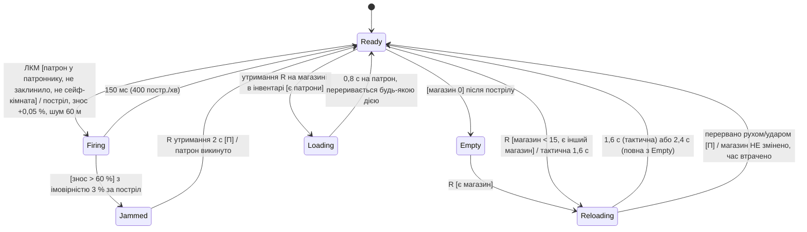
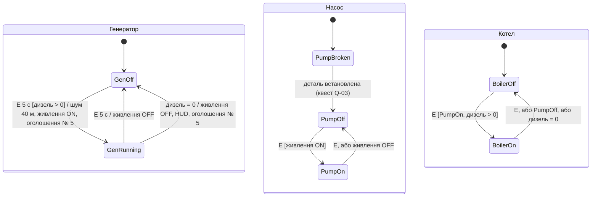
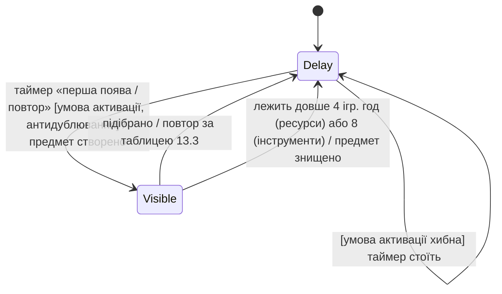

# Контракти взаємодії систем

Цей файл відповідає на питання «хто володіє станом, коли він змінюється і в якому порядку»,
а не «які числа». Числа живуть у `02-spec-mvp.md`. Позначка **[П]** = рішення пілота, якого в
docx v1.2 не було; кожне таке рішення перелічене в кінці файлу для підтвердження.

Зміст: A. Модель світу · B. Часовий контракт · C. Діаграми станів · D. Порядок обробки подій ·
E. Рішення пілота.

---

## A. Модель світу

Загальні правила для всіх сутностей:

- **ID стабільний на весь ран** і серіалізується. ID виводиться з seed і позиції, а не з
  порядку створення, щоб один seed давав однакові ID (docx §6.4).
- **Один власник стану.** Тільки система-власник змінює поле; решта читають. Зміна ззовні
  йде через команду до власника, яка виконується в тіку власника (розділ D).
- **Похідне не зберігається.** Поле, яке можна обчислити з інших (загальне HP, повітряні зони,
  «активний» заражений), перераховується після завантаження.

| Сутність | ID | Власник стану | Стан, що зберігається | Хто і як змінює | Похідне (не зберігається) |
|---|---|---|---|---|---|
| **Клітинка** (Cell) | `(x, y)` у сітці N × N, N непарне | `World.MazeGen` при генерації; далі `World.Architect` | тип: стіна / прохід / проріз кімнати; регіон Вороного; прапорець застійної зони (заморожений, REQ-VENT-11) | лише подія реконфігурації (стіна ↔ прохід) | повітряна зона; камера стоку (BFS від камер); температура (з теплового об’єму) |
| **Панель** (Panel) | ID клітинки-стіни, в якій стоїть | `World.Architect` | `stationary / moving / pocketPanel(expiresAt)` | подія реконфігурації 7.3: сирена 5 с → рух 4 с; панель-мішок має термін 120–360 ігр. хв | валідність позиції (BFS ядра, заборонені зони) |
| **Кімната** (Room) | `R<n>` за порядком вирізання від seed | `World.MazeGen`; вміст — `Rooms` | тип (13.1), прямокутник клітинок, список прорізів, список об’єктів, прапорець «ядро» (7.2) | тип і геометрія незмінні; об’єкти — подієво | тепловий об’єм (з дверей); герметизація (з панелей) |
| **Двері** (Door) | `D<Room>.<n>` | `Rooms` | `open / closed / locked(side)`; міцність не потрібна у MVP | гравець E 0,5 с / F 3 с; заражені за 13.6; NPC 50 % зачиняють; Набряклий → `open` назавжди (уламки) | коефіцієнт повітря k (0,25 / 0,05 / 0 при панелі) |
| **Кліматичний регіон** (Region) | `C<n>` 1…6, порядок призначення проєктних температур | `World.Climate` | T_проєкт (незмінна); T_регіону (тепловий об’єм) | лише тік клімату (REQ-VENT-07) | T_подачі своєї гілки (таблиця режимів) |
| **Тепловий об’єм** (HeatVolume) | ID регіону або ID кімнати із зачиненими дверима | `World.Climate` | T | тік клімату | межі — з дверей і панелей на момент тіку |
| **Повітряна зона** (AirZone) | не зберігається; тимчасовий індекс від заливки | `World.Vent` **[П]** (у docx це частина Climate) | CO (масив по зонах зберігається за ID кореневої решітки або кореневої клітинки **[П]**), CO₂ (поле є, у MVP 0), лічильник мішка | перерахунок після кожної реконфігурації; CO — тік | прапорці «без притоку», «герметизована», V_зони і Q_зони |
| **Гілка вентиляції** (Branch) | `B<Region>` — одна на регіон | `World.Vent` | заслінка 0/1; вентиль 0/1; стан «заклинено» (поле є, MVP не використовує); таймер базового народження і його фаза | заслінка: гравець 10 с або термінал; вентиль: гравець 10 с або Архітектор; таймер: `AI.Population` | потік (REQ-VENT-04); f(потік) |
| **Решітка** (Grate) | `G<Branch>.<n>` за порядком MST | `World.Vent` | noSpawn (незмінний); прапорець потоку | потік — похідне від гілки і герметизації | «мертва» (пробита труба, EPIC-27) |
| **Серце / шибер** | один на сектор | `World.Vent` | шибер 0 / 0,5 / 1; R (0 у MVP) | гравець 10 с; Архітектор при живленні (EPIC-26) | вентилятор працює = живлення |
| **Живлення сектора** (Power) | один на сектор | `Rooms.Generator` | генератор `off / running`; дизель у баку (л); насос `off / on`; котел `off / on` | гравець E 5 с; дизель −1 л / 30 хв генератора, / 45 хв котла; дизель 0 → усе `off` | T_подачі всіх гілок; доступність термінала |
| **Заражений** (Zombie) | `Z<n>`, лічильник від seed, ніколи не перевикористовується | `AI.Zombie` (поведінка), `AI.Population` (народження, смерть, мутація) | повний логічний запис docx §16.4 | тік поведінки 10 Гц; популяція 1 Гц | «активний» (відстань до гравця) |
| **Лічильник популяції** | один на сектор | `AI.Population` | число; прапорець «защіпка спрацювала» | лише транзакція популяції (розділ D) | — |
| **Панель шлюзу** | один на сектор | `Rooms.Airlock` | `closed / open(latched)`; вставлені ключ-картки 0…3 | защіпка від лічильника (D.3); ключ-картки гравцем | — |
| **NPC** | `N<n>` | `AI.NPC` | потреби, дія, розклад, інвентар, репутація | тік 2 Гц; потреби раз на 5 ігр. хв | — |
| **Предмет у світі** | `I<spawner>.<n>` | `Items.Spawner` (доки лежить), `Inventory` (після підбору) | позиція, стан ланцюжка | спавнер 1 Гц; підбір подієво | — |
| **Квест** | `Q-01…03` | `Quests` | стан (C.4), таймер строку, ID виданої картки | події від NPC, кімнат, смерті | маркер на карті |
| **Архітектор** | один на сектор | `World.Architect` | тривога 0…100; журнал дій; час наступної події | дії гравця +5…+25; спад −1/год; події | інтервал реконфігурації × f(тривога) |

---

## B. Часовий контракт

### B.1 Дві шкали

| Шкала | Одиниця | Хто веде | Використання |
|---|---|---|---|
| **Реальний час** | секунда (`Time.unscaledDeltaTime`) | Unity | анімації, вікна ударів, замахи, перезарядка, взаємодії «E 5 с», UI, звук |
| **Ігровий час** | ігрова хвилина = 2 с реального при масштабі 1 | `Core.Clock` | потреби, клімат, вентиляція, CO, популяція, спавнер, економіка, Архітектор, квести, таймери станів світу |

Правило запису в специфікації: кожен інтервал має шкалу. «с» = секунди реального часу;
«ігр. хв / год / доба» = ігровий час. Скорочення «/с» без шкали заборонене; у `02-spec-mvp.md`
поле «Одиниці» це фіксує.

Обмінний курс: 1 ігр. хв = 2 с; 1 ігр. год = 2 хв; 1 доба = 48 хв реального часу.

### B.2 Режими годинника

| Режим | Масштаб | Що тікає | Що не тікає | Вхід / вихід |
|---|---|---|---|---|
| **Гра** | 1 | усе | — | — |
| **Пауза** (Esc, меню, діалог помилки 16.7) | 0 | UI | і реальні, і ігрові таймери гри. Реальні таймери зброї та взаємодій зберігають залишок і продовжуються після виходу **[П]** | Esc; при виході з паузи 0,5 с реального часу без атак заражених **[П]** |
| **Сон** | 10 | ігровий час усіх систем у спрощеному тіку (docx §11.7) | реальні таймери гравця (перезарядка тощо) стоять; повна симуляція заражених далі 60 м | вибір тривалості в ліжку; вихід: час минув, шум ≤ 15 м, падіння T_тіла, сирена панелі ≤ 15 м |
| **Пропуск після смерті** | 10, той самий спрощений тік | як у сні, плюс всі заражені у спрощеному тіку (гравця в світі немає) | реальні таймери гравця скинуті | екран смерті → «Продовжити» → рівно 6 ігр. год → пробудження |
| **Завантаження** | 0 | нічого | — | після відновлення стану — 1 тік ігрової хвилини «сухий» (без подій) для перерахунку похідного **[П]** |

Спрощений тік (сон і пропуск) не змінює правила, лише частоту: потреби, клімат, CO і
вентиляція тікають щохвилини, як завжди; популяція 1 раз на ігр. хв по сітці; NPC — лише
розклад телепортом раз на 10 ігр. хв, без Utility-оцінки, без бою і без шкоди; спавнер і
економіка звичайним тіком. Бюджет ≤ 4 мс на тік на профілі Low.

### B.3 Частоти тіків (нормальний режим)

| Система | Частота | Шкала | Примітка |
|---|---|---|---|
| Core.Clock, Player.Controller, Combat | кожен кадр | реальна | |
| AI.Perception, AI.Zombie (поведінка) | 10 Гц | реальна | далі 40 м на Low — 1 Гц, ті самі правила |
| AI.NPC (мозок) | 2 Гц | реальна | потреби NPC — раз на 5 ігр. хв |
| AI.Population (пари, таймери гілок, мутація) | 1 Гц | реальна для перевірки пар; таймери в ігровому часі | |
| Items.Spawner | 1 Гц | реальна для перевірки; інтервали в ігрових хвилинах | |
| Player.Needs, Player.Health, World.Climate, World.Vent (потік, CO) | 1 ігр. хв | ігрова | один спільний тік, порядок у D.1 |
| Economy | 1 ігр. год | ігрова | |
| World.Architect | подія 60–600 ігр. хв | ігрова | сирена і рух панелі — реальний час 5 с + 4 с |
| Автозбереження | подієво | — | знімок на межі кадру після тіку ігрової хвилини (docx §16.4) |

---

## C. Діаграми станів

Стан у діаграмі = стан, що зберігається. Переходи підписані «подія [умова] / ефект».

### C.1 Зброя (пістолет ПМ-9)



Часова шкала: усе в секундах реального часу. У паузі таймери зберігають залишок.
Стан зброї зберігається: `Ready/Empty/Jammed`, патронів у магазині, патрон у патроннику, знос.
`Firing`, `Reloading`, `Loading` при збереженні згортаються до `Ready`/`Empty` без зміни
магазину **[П]**.

### C.2 Двері

```mermaid
stateDiagram-v2
    [*] --> Closed
    Closed --> Open : гравець E 0,5 с / скрип, шум 6 м
    Closed --> Open : Блукач або Бігун 1 с
    Closed --> Open : NPC
    Open --> Closed : гравець E 0,5 с
    Open --> Closed : NPC [50 %]; торговець на ніч
    Closed --> Locked : гравець F 3 с [є лом] / лом −5
    Locked --> Closed : гравець 3 с [з боку, де ставили]
    Locked --> Searching : Блукач або Бігун / стан зараженого «пошук»
    Closed --> Broken : Набряклий 3 удари (6 с) / шум 20 м
    Locked --> Broken : Набряклий 3 удари (6 с) / шум 25 м
    Broken --> Broken : уламки не зачиняються
    Closed --> Sealed : панель у прорізі [кімната поза ядром, без гравця і NPC]
    Open --> Sealed : панель у прорізі [та сама умова]
    Sealed --> Closed : панель прибрано [П]
```



`Searching` тут — не стан дверей, а переходу зараженого; двері лишаються `Locked`. Виняток:
ролети сейф-кімнати і панель шлюзу не мають переходу в `Broken` (docx §13.6, аудит 3.7).
Для повітря: `Open` k = 0,25; `Closed`, `Locked` k = 0,05; `Sealed` k = 0; `Broken` = `Open`.

### C.3 Живлення: генератор, насос, котел



Інваріанти: `BoilerOn ⇒ PumpOn ⇒ живлення ON ⇒ GenRunning`. Витрата дизелю: 1 л на 30 ігр. хв
генератора плюс 1 л на 45 ігр. хв котла з одного бака 20 л; при дизель = 0 обидва гаснуть в
одному тіку, порядок: котел, насос, генератор **[П]**. T_подачі — таблиця режимів REQ-VENT-07
за станами цих трьох автоматів.

### C.4 Квест

```mermaid
stateDiagram-v2
    [*] --> Unavailable
    Unavailable --> Available : умова видачі (діалог «Завдання» / вхід у котельню)
    Available --> Active : гравець прийняв [не більше одного активного від цього NPC]
    Active --> Done : умова виконання / нагорода; перший раз за ран — ключ-картка
    Active --> Failed : провал (смерть вцілілого; строк 2 доби для Q-02)
    Active --> Available : Q-01: гравець далі 30 м понад 2 ігр. хв / вцілілий вертається
    Failed --> Available : Q-02: через 1 добу з іншим товаром
    Done --> Available : Q-01: інший вцілілий; Q-02: повторно за іншу нагороду
```

Стан і таймер строку в ігровому часі, серіалізуються; подія `quest_state` на кожен перехід.
Q-03 не має `Failed`. Смерть гравця: активний Q-01 → `Failed`, якщо вцілілий загинув; інші
лишаються `Active` (docx §11.8).

### C.5 Ланцюжок спавнера предметів (один тип у одній точці)



Усі таймери в ігрових хвилинах (× 6 від секунд оригіналу). Умова активації ресурсних
ланцюжків — REQ-POP-11 (популяція ≥ 1). Антидублювання: один видимий екземпляр рідкісного
типу на сектор, до 3 для їжі й води.

### C.6 Смерть і респавн (режим «Стандарт»)

```mermaid
stateDiagram-v2
    [*] --> Alive
    Alive --> Dying : HP < 10 / непритомність [П: лише від кровотечі; інша шкода → Dead одразу]
    Dying --> Dead : 30 с реального часу без зупинки кровотечі [П]
    Alive --> Dead : голова 0 або тулуб 0, або загальне HP 0
    Dead --> DeathScreen : / статистика, причина, автозбереження, тривога +5
    DeathScreen --> Skip6h : «Продовжити» / тіло з інвентарем 24 ігр. год, −50 % КР
    Skip6h --> Alive : 6 ігр. год у режимі пропуску / ліжко по BFS зі зв’язної зони; HP 40, потреби 50, T 36,6, стрес 60; кровотечі зупинені, рани лишаються
```



Режим «Реалізм»: `Dead → DeathScreen → [*]` із видаленням слота.

---

## D. Порядок обробки подій

### D.1 Тік ігрової хвилини — фіксований порядок

Один тік = одна транзакція. Системи виконуються послідовно в цьому порядку, кожна бачить
результат попередніх у тому ж тіку:

1. `Core.Clock` — інкремент ігрової хвилини, обчислення «настав час» для всіх таймерів.
2. `World.Architect` — якщо настав час події: перевірка BFS ядра і заборонених зон, старт
   сирени (реальний час далі). Рух панелі завершується в реальному часі; його результат
   (нова стіна) застосовується на початку наступного тіку **[П]**.
3. `World.Vent` — перерахунок повітряних зон (лише якщо панель змінилася), потоки гілок,
   тяга, T_подачі за таблицею режимів.
4. `World.Climate` — теплові об’єми (REQ-VENT-07), джерела тепла, витрата дизелю; при
   дизель = 0 автомати C.3 переходять в `Off` тут.
5. `World.Vent` (гази) — CO і CO₂ за формулою REQ-VENT-14 (Q_зони з REQ-VENT-04, злиття зон REQ-VENT-12), обмін через зачинені двері REQ-VENT-09; CO₂ і похідний O₂ активні з EPIC-27 (REQ-VENT-24).
6. `AI.Population` (таймерна частина) — таймери базового народження гілок, мутація,
   кулдауни; народження за REQ-POP-06 із транзакцією D.3.
7. `Player.Needs`, `Player.Health` — потреби, температура тіла (з даних п. 3–5), рани,
   дренаж кровотечі та інфекції.
8. `Items.Spawner` (таймерна частина), `Quests` (строки), `Economy` (раз на годину).
9. Автозбереження, якщо тригер спрацював: знімок стану після п. 8.

Реальночасові системи (бій, поведінка заражених, NPC-мозок, перевірка пар 1 Гц) працюють
між тіками ігрової хвилини і надсилають зміни популяції як команди в чергу `AI.Population`.

### D.2 Черга команд популяції

Усі зміни лічильника популяції йдуть через одну чергу з єдиним споживачем `AI.Population`:

| Команда | Джерело | Коли обробляється |
|---|---|---|
| `Kill(zombieId, cause)` | Combat, міна, NPC-охоронець, смерть від контакту (REQ-POP-02) | у тому ж кадрі, де сталася, у порядку надходження |
| `SpawnContact(pairId)` | перевірка пар 1 Гц | у тому ж кадрі |
| `SpawnBase(branchId)` | таймер гілки, тік D.1 п. 6 | у тіку ігрової хвилини |
| `Mutate(zombieId)` | таймер сектора | у тіку ігрової хвилини |

Правило порядку: **черга обробляється повністю в порядку надходження, і після кожної команди
лічильник перевіряється на защіпку** (D.3). Кадр і тік ігрової хвилини не перемішуються:
команди реального часу, що прийшли під час тіку, чекають його завершення.

### D.3 Транзакція «останній заражений і базове народження»

Сценарій із аудиту: останній заражений гине в тому ж кадрі, коли спрацьовує таймер гілки.

1. `Kill` приходить у реальному часі між тіками → обробляється негайно: популяція 1 → 0.
2. Перевірка защіпки після команди: лічильник = 0 → `Airlock.open(latched)`, подія
   `airlock_latched`, оголошення. Защіпка незворотна.
3. Наступний тік ігрової хвилини, п. 6: `SpawnBase` → популяція 0 → 1. Шлюз лишається
   відкритим (REQ-POP-08).

Якщо обидві події належать одному тіку (наприклад, `Kill` від NPC-охоронця, який
обробляється в тіку п. 7, і `SpawnBase` у п. 6), порядок задає D.1: спавн (п. 6) іде раніше
за смерть від NPC (п. 7), тому лічильник іде 1 → 2 → 1, і защіпка не спрацьовує. Це свідомо:
**защіпка спрацьовує лише на фактичному дотику до 0 після повної обробки команди**, а не
на «мав би бути 0». Тест: обидва порядки перевіряються юніт-тестом з детермінованою чергою.

### D.4 Інші конфлікти з фіксованим порядком

| Ситуація | Порядок | Наслідок |
|---|---|---|
| Панель стає в проріз кімнати, куди щойно зайшов NPC | перевірка заборонених зон у момент старту сирени (п. 2); якщо за 5 с сирени хтось увійшов у клітинку панелі, панель штовхає його (docx §7.3), кімната все одно герметизується **[П]** | NPC у герметизованій кімнаті — його проблема кисню (EPIC-27) |
| Заслінка закрита гравцем і відкрита Архітектором у одному тіку | команди до `World.Vent` у порядку надходження; остання перемагає; обидві в журналі; відкат гравця недоступний (аудит 3.9) | |
| Дизель закінчився в тіку, де котел мав підняти T_подачі | п. 4 гасить автомати до розрахунку теплових об’ємів у тому ж п. 4 → тік уже з T_подачі = +9 | без «останнього гарячого» тіку |
| Гравець засинає, і в тому ж тіку панель з сиреною ≤ 15 м | сон стартує після тіку; сирена (реальний час) будить наступним кадром | сон ≤ 1 кадр, як задумано |
| Смерть гравця під час перезарядки | `Combat` скидає реальні таймери; стан зброї згортається за C.1 | магазин не втрачається |
| Збереження під час руху панелі | знімок чекає завершення руху (≤ 4 с), бо панель `moving` не серіалізується **[П]** | |

---

## E. Рішення пілота для підтвердження

Усі позначені **[П]** місця — це те, чого docx v1.2 не визначає. Пропоновані значення:

1. Пауза зберігає залишок реальних таймерів; 0,5 с без атак після виходу з паузи.
2. Після завантаження один «сухий» тік для перерахунку похідного стану.
3. Зброя: перерване перезаряджання не змінює магазин; розклинювання R 2 с; стани `Firing/Reloading/Loading` не серіалізуються.
4. Двері: `Sealed → Closed` при прибиранні панелі (двері повертаються в попередній стан `Closed`, а не `Open`).
5. Дизель = 0 гасить котел, насос, генератор в одному тіку саме в цьому порядку.
6. Смерть: HP < 10 дає непритомність лише від кровотечі, 30 с реального часу до смерті; інша шкода до 0 вбиває одразу.
7. Результат руху панелі застосовується на початку наступного тіку ігрової хвилини.
8. Повітряна зона ідентифікується кореневою решіткою або кореневою клітинкою для збереження CO.
9. `World.Vent` як окремий власник вентиляції та газів замість частини `World.Climate`.
10. Знімок збереження чекає завершення руху панелі.
11. Панель, що стартувала при порожній кімнаті, герметизує її, навіть якщо NPC увійшов під час сирени.
